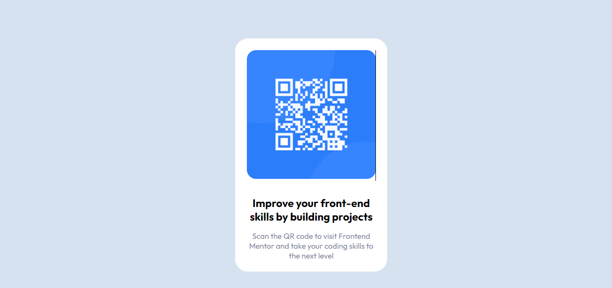

# Frontend Mentor - QR code component solution

This is a solution to the [QR code component challenge on Frontend Mentor](https://www.frontendmentor.io/challenges/qr-code-component-iux_sIO_H). Frontend Mentor challenges help you improve your coding skills by building realistic projects. 

## Table of contents

- [Overview](#overview)
  - [Screenshot](#screenshot)
  - [Links](#links)
- [My process](#my-process)
  - [Built with](#built-with)
  - [What I learned](#what-i-learned)
  - [Continued development](#continued-development)
  - [Useful resources](#useful-resources)
- [Author](#author)

### Screenshot
Form

Active

### Links

- Solution URL: [Link to Soulution](https://www.frontendmentor.io/solutions/qr-code-component-using-sass-D1pxDunfH-)
- Live Site URL: [Link to Live](https://nonoza.github.io/qr-code-component-main/)

## My process
- Downloaded the assets and open the folder on VC(Visual Studio).
- I installed Sass;
- Prepared sass files for (colors, typography) according to the style guide;
- Started with the structure of the page (HTML);
- Then, I started styling the page using mobile first and ended with desktop using sass.
 
### Built with

- Semantic HTML5 markup
- CSS custom properties
- Flexbox
- Sass
- mobile first

### What I learned

This was a simple component that I had to build. I learned SASS in building this project and also upskilling my flexbox skills.

### Useful resources

- [Sass](https://sass-lang.com/guide) - The Sass website has been helping in following all the steps in building with Sass

## Author

- Website - [Pretty Kunene](http://prettynkunene.co.za/)
- Frontend Mentor - [@nonoza](https://www.frontendmentor.io/profile/nonoza)

